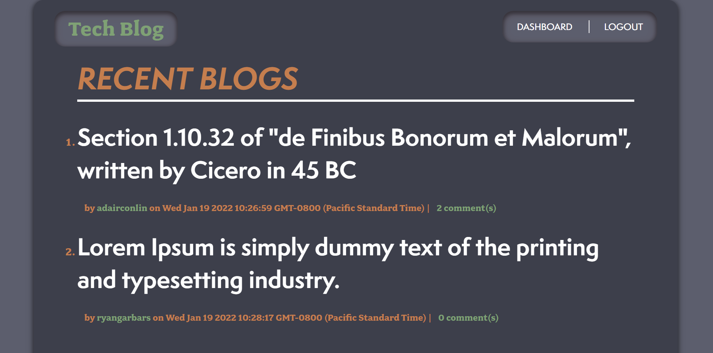

# Tech Blog Application
## View deployment on Heroku [here](https://sheltered-badlands-90401.herokuapp.com/)!


## Description
Tech Blog is a blogging application meant for developers to write, share, and comments all things coding. This application was built from scratch and deployed to Heroku. Tech Blog allows users to read the content throughout the website, but requires user sign-in to create a post or comment on a post. It follows the MVC paradigm and it uses Handlebars.js as the templating language, Sequelize as the ORM, and the express-session npm package for authentication.

## User Story
```
AS A developer who writes about tech
I WANT a CMS-style blog site
SO THAT I can publish articles, blog posts, and my thoughts and opinions
```

## Expected Functionality of Application
```
GIVEN a CMS-style blog site
WHEN I visit the site for the first time
THEN I am presented with the homepage, which includes existing blog posts if any have been posted; navigation links for the homepage and the dashboard; and the option to log in
WHEN I click on the homepage option
THEN I am taken to the homepage
WHEN I click on any other links in the navigation
THEN I am prompted to either sign up or sign in
WHEN I choose to sign up
THEN I am prompted to create a username and password
WHEN I click on the sign-up button
THEN my user credentials are saved and I am logged into the site
WHEN I revisit the site at a later time and choose to sign in
THEN I am prompted to enter my username and password
WHEN I am signed in to the site
THEN I see navigation links for the homepage, the dashboard, and the option to log out
WHEN I click on the homepage option in the navigation
THEN I am taken to the homepage and presented with existing blog posts that include the post title and the date created
WHEN I click on an existing blog post
THEN I am presented with the post title, contents, post creator’s username, and date created for that post and have the option to leave a comment
WHEN I enter a comment and click on the submit button while signed in
THEN the comment is saved and the post is updated to display the comment, the comment creator’s username, and the date created
WHEN I click on the dashboard option in the navigation
THEN I am taken to the dashboard and presented with any blog posts I have already created and the option to add a new blog post
WHEN I click on the button to add a new blog post
THEN I am prompted to enter both a title and contents for my blog post
WHEN I click on the button to create a new blog post
THEN the title and contents of my post are saved and I am taken back to an updated dashboard with my new blog post
WHEN I click on one of my existing posts in the dashboard
THEN I am able to delete or update my post and taken back to an updated dashboard
WHEN I click on the logout option in the navigation
THEN I am signed out of the site
WHEN I am idle on the site for more than a set time
THEN I am able to view comments but I am prompted to log in again before I can add, update, or delete comments
```

## Installation
### For use on personal machine
In order to use this project, you can clone the repository onto your own system. Make sure to create a `.gitignore` file in the projects root directory that includes `node_modules/` and .`DS_Store` in good practice. Run the command `npm init` to initialize Node.js, then install the following technology:
- [Sequelize](https://www.npmjs.com/package/sequelize)
- [MySQL2](https://www.npmjs.com/package/mysql2)
- [Express.js](https://www.npmjs.com/package/express)
- [Handlebars.js](https://www.npmjs.com/package/express-handlebars)
- [dotenv](https://www.npmjs.com/package/dotenv)
- [bcrypt](https://www.npmjs.com/package/bcrypt)
- [express-session](https://www.npmjs.com/package/express-session)
- [connect-session-sequelize](https://www.npmjs.com/package/connect-session-sequelize)

## Usage
### For use on personal machine
After the Installation steps, you have add your own `.env` file to the root directory with the following setup:
```
DB_NAME=tech_blog
DB_USER=<your_mysql_username>
DB_PW=<your_mysql_password>
```
Now you have to create the database in your MySQL shell. Run the command `mysql -u root -p` followed by your MySQL password. Then, after making sure you're in the project root directory, run `source db/schema.sql` to create the database and necessary tables. You can now exit out of MySQL and run `npm start` in your regular CLI. This will start the server. Finally, navigate to `http://localhost:3001` in your browser to interact with the application.

### On Heroku
View the deployed application [here](https://sheltered-badlands-90401.herokuapp.com/)!

## Questions
If you have any questions on this project, feel free to reach me through my [GitHub profile](https://github.com/adairconlin/), or email me at adairconlin@gmail.com.